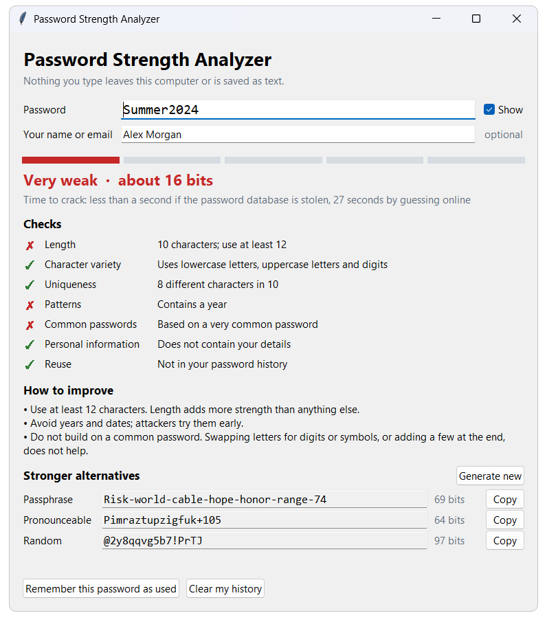

# Password Strength Analyzer

[](https://github.com/TBAILIBILLAL/password-analyzer/actions/workflows/ci.yml)

A tool that tells you how strong a password really is, explains why, suggests stronger
alternatives and refuses passwords you have used before. It runs as a desktop window
or from the command line, and needs nothing but Python.



## What it checks

| Check | What it looks for |
|---|---|
| **Length** | At least 12 characters |
| **Character variety** | Lowercase letters, uppercase letters, digits and symbols |
| **Uniqueness** | Repeated characters (`aaa`), repeated blocks (`abcabc`), too few different characters |
| **Patterns** | Sequences (`abc`, `4321`), keyboard patterns (`qwerty`, `1qaz`), years |
| **Common passwords** | 270 passwords attackers try first, also when disguised (`P@ssw0rd!`), and dictionary words |
| **Personal information** | Parts of your name or email inside the password (optional) |
| **Reuse** | Passwords you used before, and small variations of them (optional) |

It then gives a verdict from **Very weak** to **Very strong**, an estimate of the time
needed to crack the password, advice on what to change, and three stronger
alternatives:

- a **passphrase** of six random words, the easiest to remember;
- a **pronounceable** password, shorter and still sayable;
- a **random** password, the strongest, for a password manager.

## Quick start

Requires Python 3.10 or newer. There is nothing to install.

```bash
python -m password_analyzer
```

On Windows you can also double-click `run.bat`.

## Command line

```bash
python -m password_analyzer check
```

The password is typed at a hidden prompt. It is never taken from the command line
arguments, because those end up in the shell history.

```
Strength: Very weak (0/4, about 16 bits)
Time to crack: less than a second offline, 27 seconds online

Checks
  [!!] Length: 10 characters; use at least 12
  [ok] Character variety: Uses lowercase letters, uppercase letters and digits
  [ok] Uniqueness: 8 different characters in 10
  [!!] Patterns: Contains a year
  [!!] Common passwords: Based on a very common password

How to improve
  - Use at least 12 characters. Length adds more strength than anything else.
  - Avoid years and dates; attackers try them early.
  - Do not build on a common password. Swapping letters for digits or symbols, or adding a few at the end, does not help.
```

| Command | Purpose |
|---|---|
| `check` | Analyze a password. Exit code 0 means Strong or better, 1 means weaker |
| `check --personal "name or email"` | Also check that the password does not contain your details |
| `check --account NAME --save` | Check against that account's history, then remember the password as used |
| `check --json` | Machine-readable output, for use in scripts |
| `generate` | Print strong passwords |
| `history --account NAME` | Show how many passwords are remembered; add `--clear` to forget them |

## How strength is estimated

A password is as strong as the number of guesses needed to reach it. Counting character
types is not enough: `P@ssw0rd123!` has all four types and is still among the first
things an attacker tries.

So the analyzer looks at the password the way an attacker would:

1. It finds the predictable parts: common passwords, dictionary words (also with
   substitutions such as `@` for `a`), sequences, keyboard patterns, repeats, years and
   your personal details.
2. Each predictable part counts as a few guesses. A dictionary word counts as one
   choice among some thousands of words, not as six or seven random letters.
3. Whatever is left counts as random characters.

The result is an estimate in bits. Every extra bit doubles the guesses needed.

| Bits | Verdict |
|---|---|
| under 25 | Very weak |
| 25 to 39 | Weak |
| 40 to 59 | Fair |
| 60 to 79 | Strong |
| 80 or more | Very strong |

A common password is always Very weak, and a password shorter than 8 characters is
never rated above Weak. Crack times assume 10 billion guesses per second for a stolen
database of quickly hashed passwords, and 1,000 per second for guessing online.

The strength shown for a **suggested** password is not an estimate. It is calculated
exactly from how the password was generated: the number of equally likely results the
method can produce.

## Password history

When you choose "Remember this password as used" (or pass `--save`), the tool stores a
record in a small SQLite database so it can refuse the password next time.

- The password itself is never stored. The database holds a salted PBKDF2-HMAC-SHA256
  hash with 200,000 rounds.
- A second hash covers the password's letters only, which catches small variations:
  after `Summer2023!`, both `Summer2024!` and `summer#99` are refused as too similar.
- Each account has its own random salt, so the same password gives different hashes
  for different accounts.
- The ten most recent passwords per account are kept.

The database is at `%APPDATA%\PasswordAnalyzer\history.db` on Windows and
`~/.password_analyzer/history.db` elsewhere. Set `PASSWORD_ANALYZER_DB` or pass `--db`
to use another file.

## Privacy

- Nothing is sent anywhere. The tool makes no network connections.
- The password and pieces of it are never printed, logged or written to disk. Feedback
  says "contains a year", not which year.
- Suggested passwords come from the operating system's secure random source
  (`secrets`).

## Project layout

```
password_analyzer/
  analyzer.py      pattern detection, strength estimate, checks and advice
  generator.py     passphrase, pronounceable and random password generators
  history.py       password history in SQLite (salted hashes only)
  wordlists.py     common passwords and the passphrase word list
  data/dictionary.txt   18,205 English words for dictionary-word detection
  gui.py           the window (Tkinter)
  cli.py           the command line
tests/             51 tests
```

About 830 lines of code, standard library only.

## Tests

```bash
python -m unittest discover -s tests -t .
```

The tests cover pattern detection, the strength estimate, the generators, the history
database (including that no password text reaches the file), the command line and the
window itself.

## Limitations

- The strength is an estimate. A password built from words that are in none of the
  tool's lists is counted as random letters and is rated stronger than it is.
- The word lists are English. The large dictionary was derived from arXiv paper
  abstracts, so it knows technical vocabulary better than slang or names.
- The crack times depend on the assumed guessing speeds, which vary widely in practice.
- The history check runs on your computer for your own passwords. It does not check
  whether a password has appeared in public data breaches.

## Licence

Released under the [MIT License](LICENSE). The large dictionary was built from arXiv
metadata, which arXiv makes available under the CC0 1.0 public domain dedication.
